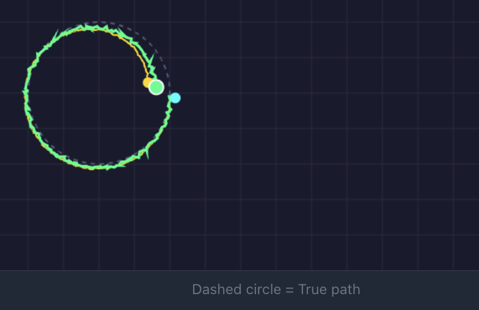

# Sensor Fusion Cheatsheet

## The Core Concept

```
LOW NOISE + HIGH DRIFT     HIGH NOISE + NO DRIFT
   (IMU, Encoders)     +    (Camera, AprilTags)
          │                        │
          └──────────┬─────────────┘
                     ▼
           LOW NOISE + NO DRIFT
              (Fused result)
```


• IMU provides smooth, high-frequency updates but drifts over time
• Camera gives absolute position but with measurement noise
• Fusion uses algorithms like Kalman filtering to combine both
• Result: Smooth tracking without long-term drift

## Kalman Filter Loop

```
PREDICT (motion) ──► UPDATE (sensor) ──► PREDICT ──► ...
   uncertainty ↑       uncertainty ↓
```

## Key Equations

```
Kalman Gain:  K = P / (P + R)
Update:       x = x + K × (measurement - x)
```

- **K ≈ 1**: Trust sensor more
- **K ≈ 0**: Trust prediction more

## Tuning

| Parameter | What it does |
|-----------|--------------|
| Q (process noise) | Higher = trust sensors more |
| R (measurement noise) | Higher = trust prediction more |

## Sensor Characteristics

**Motion Sensors** (for PREDICT step) - low noise, high drift:
- IMU / Gyro
- Wheel Encoders / Odometry
- Optical Tracking Sensor

**Position Sensors** (for UPDATE step) - high noise, no drift:
- Camera / AprilTags

| Sensor | Noise | Drift | Role |
|--------|-------|-------|------|
| IMU / Gyro | Low | High | Predict |
| Encoders / Odometry | Low | High | Predict |
| AprilTags / Camera | High | None | Update |

## WPILib Equivalent

```java
VecBuilder.fill(0.1, 0.1, 0.1)  // stateStdDevs = Q
VecBuilder.fill(0.5, 0.5, 0.5)  // visionStdDevs = R
```
