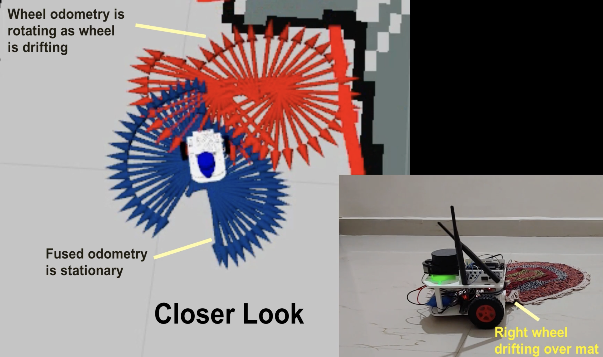

# Why Sensor Fusion Works

## The Problem

No sensor is perfect:

- **IMU/Encoders**: Smooth readings, but errors accumulate (drift)
- **Camera/AprilTags**: Absolute position, but noisy and not always visible

## The Solution

Combine sensors with **opposite weaknesses**:

```
IMU:    ████████████████░░░░░░░░░░░░░░░░  (good short-term, drifts long-term)
Camera: ░░░░████░░░░████░░░░████░░░░████  (intermittent but accurate)
FUSED:  ████████████████████████████████  (best of both)
```

## Why Combining Works

1. **Complementary strengths** - Each sensor covers the other's weakness
2. **Noise reduction** - Independent errors partially cancel out
3. **Redundancy** - If one sensor fails, others keep working



*Source: [YouTube](https://www.youtube.com/watch?v=0yICGqriN3g)*

The Kalman filter alternates between two steps:

### 1. Predict (use motion sensors)
- "Based on IMU/encoders, I think I moved here"
- Uncertainty **increases** (things can go wrong)

### 2. Update (use position sensors)  
- "AprilTag says I'm actually here"
- Uncertainty **decreases** (we got real information)

```
Time:      t=0    t=1    t=2    t=3    t=4    t=5
Uncert:    0.1 → 0.2 → 0.3 → 0.4 → 0.1 → 0.2
                                    ↑
                              Camera update!
```

## The Key Insight

> Fuse **low-noise/high-drift** sensors with **high-noise/no-drift** sensors to get **low-noise AND no-drift**.

This is exactly what your robot needs!
